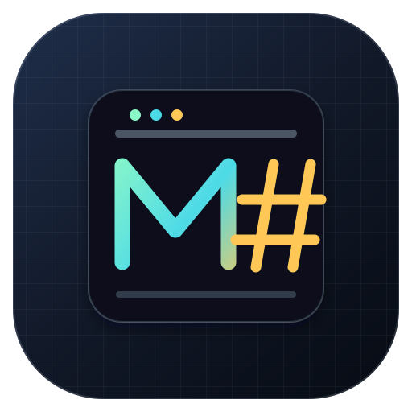
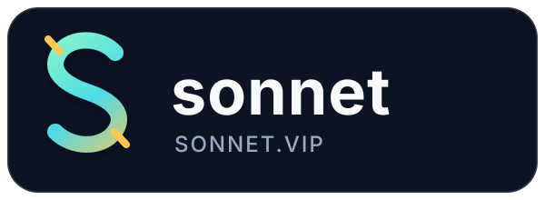

<div align="center">



# MoneyPrinter#

**可审计、可复现的软件讲解视频制作工具与 Codex 技能系列**

[](https://dotnet.microsoft.com/)
[](https://learn.microsoft.com/dotnet/csharp/)
[](https://ffmpeg.org/)
[](LICENSE)

**MPS / MP#** · [GitHub](https://github.com/IoTSharp/MoneyPrinterSharp) · [文档](docs/README.md) · [路线图](ROADMAP.md) · [变更日志](CHANGELOG.md)

</div>

## 项目简介

**MoneyPrinter#**（简称 **MPS** 或 **MP#**）是一个面向软件产品讲解视频的开源工具链。它以 C# / .NET 10 为核心，将源码审计、叙事规划、分镜脚本、模型选择、旁白、口型、透明合成、质量验收和费用交付组织为一套可追踪的制作流程。

项目的目标不是生成不可验证的宣传片，而是把软件能力转换成有证据、有记录、可复现的讲解视频。所有关键主张都应追溯到源码、路由/API、可复现页面或脱敏素材。

## 重要说明

- 本项目仅提供通用工具、离线媒体管线和 Codex 技能；不包含生产账号、业务数据、供应商密钥或固定机器路径。
- 使用外部模型、媒体服务或第三方平台时，请先阅读对应服务条款，并由使用者自行承担合规、账号和费用责任。
- 媒体生成与模型调用可能产生第三方费用。超时任务不能直接视为失败，重复提交前应先核对已有任务和费用记录。
- 真实素材验收应独立检查透明通道、音画时长、字幕和口型声明，基础构建或 `doctor` 检查不能替代成片验收。

## 核心能力

- **功能审计**：从源码、页面和 API 证据建立功能清单，区分已验证、待验证和不可声明内容。
- **结构化创作**：依次生成叙事计划、分镜脚本和模型选择记录，保持每一步可回溯。
- **本地媒体管线**：使用 FFmpeg / FFprobe 完成探测、切分、关键帧、渲染和验收，不依赖 Python 或 JavaScript 业务脚本。
- **可恢复任务**：对 Moark 提交与轮询保留任务记录，支持超时恢复和取消边界。
- **成本核算**：按 `provider + task_id` 去重，分别记录已确认金额、未知价格和估算预留。
- **技能安装**：通过统一入口安装 11 个阶段技能，并保留相对引用和版本更新能力。

## 制作流程

```text
feature-audit
      |
      v
narrative-plan -> screenplay -> model-selection -> presenter -> narration
                                                        |
                                                        v
                         lip-sync -> composition -> quality-review -> cost-delivery
```

总入口位于 [`skills/video-production-series`](skills/video-production-series/)，阶段契约和 CLI 参考见 [`references`](skills/video-production-series/references/)。

## 目录结构

```text
MoneyPrinterSharp/
├── skills/                         # 总入口与 10 个阶段技能
│   └── video-production-series/    # 共享契约、质量门和 CLI 参考
├── src/VideoProduction/             # .NET 10 C# CLI 与 FFmpeg 管线
├── tests/VideoProduction.Tests/     # 无付费请求的离线回归测试
├── docs/                            # 安装、工作流、媒体和费用文档
├── assets/                          # 项目与赞助商公开门面资源
└── LICENSE                          # MIT License
```

## 快速开始

### 环境要求

- Windows + PowerShell 7 或更高版本
- .NET SDK 10
- FFmpeg 与 FFprobe（媒体命令执行前可用 `doctor` 探测）

### 构建与验证

在仓库根目录执行：

```powershell
dotnet build .\src\VideoProduction\VideoProduction.csproj --disable-build-servers -p:UseSharedCompilation=false
dotnet run --project .\tests\VideoProduction.Tests\VideoProduction.Tests.csproj -p:UseSharedCompilation=false
dotnet run --project .\src\VideoProduction\VideoProduction.csproj --no-build -- help
```

### 安装技能并初始化项目

```powershell
dotnet run --project .\src\VideoProduction\VideoProduction.csproj -- install-skills
dotnet run --project .\src\VideoProduction\VideoProduction.csproj -- init --project .\runs\demo --title "产品功能讲解" --minutes 5
```

CLI 支持的主要命令包括：

```text
init | features | validate | costs | credentials set|status
moark submit|poll
doctor | probe | split | key | render | verify
install-skills
```

完整参数、产物契约和费用边界见 [`CLI 参考`](skills/video-production-series/references/cli-reference.md)、[`安装说明`](docs/installation.md) 和 [`开发交接`](docs/development.md)。

## 赞助商

感谢 [Sonnet](https://sonnet.vip) 对 MoneyPrinter# 开源项目的赞助支持。Sonnet 的详细服务信息请访问 [sonnet.vip](https://sonnet.vip)。

<table>
<tr>
<td width="180"><a href="https://sonnet.vip"></a></td>
<td><strong>Sonnet</strong><br/>感谢 Sonnet 支持开源软件讲解视频工具链的持续维护与公开协作。点击 logo 访问 <a href="https://sonnet.vip">sonnet.vip</a>。</td>
</tr>
</table>

## 许可证

本项目采用 [MIT License](LICENSE) 发布。除非许可证另有明确规定，软件按“现状”提供，不附带任何明示或默示担保。

Copyright (c) 2026 IoTSharp

## 致谢

感谢 .NET、FFmpeg 以及所有参与问题反馈、文档改进和测试验证的开源社区成员。

<div align="center">

**如果 MoneyPrinter# 对你有帮助，欢迎在 GitHub 上点亮 Star。**

</div>
